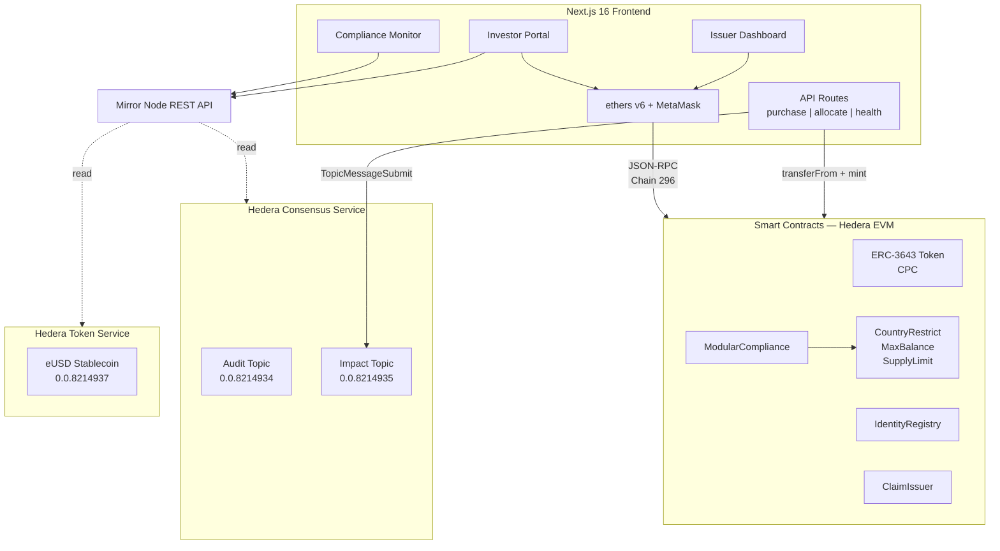

# Coppice — Green Bonds built on Hedera's ATS and Gaurdian

Coppice is a **compliant green bond tokenization platform** built on the [ERC-3643](https://erc3643.info/) (T-REX) standard, deployed on the **Hedera network**. It brings institutional-grade security token compliance to decentralized green finance — with on-chain identity verification, modular compliance enforcement, and an immutable audit trail powered by Hedera Consensus Service.

Named after the ancient woodland management technique where trees are sustainably harvested and regrow — a metaphor for sustainable finance.

Built for the **Hedera Hello Future: Apex Hackathon 2026** (DeFi & Tokenization track).

## Why Coppice?

Green bonds are a [**$527B annual market**](https://www.coherentmarketinsights.com/market-insight/green-bonds-market-5765) growing 10% year-over-year, but greenwashing and opaque fund tracking erode investor trust. Issuers self-certify with minimal accountability. Impact reports appear 12+ months late.

Coppice solves this by:

- **Enforcing compliance at the protocol level** — [ERC-3643](https://eips.ethereum.org/EIPS/eip-3643) makes it impossible to transfer tokens to non-compliant addresses. Identity verification, KYC/AML claims, and jurisdiction checks are baked into every transfer.
- **Tracking use-of-proceeds on-chain** — Every fund allocation is recorded to HCS as an immutable, timestamped, publicly verifiable record. No more waiting for annual PDF reports.
- **Using 4 Hedera services** — Smart Contracts, Consensus Service, Token Service, and Mirror Node — demonstrating deep Hedera integration.

**Prior art:** [ABN AMRO tokenized a €5M green bond](https://www.abnamro.com/en/news/abn-amro-registers-first-digital-green-bond-on-the-public-blockchain) using ERC-3643 on Polygon (September 2023), [raising funds from DekaBank with fully on-chain compliance](https://tokeny.com/tokeny-fuels-abn-amro-bank-in-tokenizing-green-bonds-on-polygon/). Coppice replicates this model on Hedera and adds what their implementation lacks: on-chain use-of-proceeds tracking via HCS.

**Strategic alignment:** The [Hedera Foundation joined the ERC-3643 Association](https://hedera.foundation/blog/scaling-institutional-rw-as-the-hbar-foundation-joins-the-erc-3643-association) alongside DTCC, ABN AMRO, Fireblocks, and Deloitte — signaling institutional commitment to compliant tokenization on Hedera.

## Architecture



### 4 Hedera Services Integrated

1. **Smart Contracts (Hedera EVM)** — Full ERC-3643 T-REX suite: Token, IdentityRegistry, ModularCompliance, ClaimIssuer, TrustedIssuersRegistry, ClaimTopicsRegistry, IdentityRegistryStorage, and 3 compliance modules. Deployed via TREXFactory with OnchainID identity proxies.
2. **Hedera Consensus Service (HCS)** — Guardian anchors all Verifiable Credentials to HCS topics, creating an immutable, timestamped, publicly verifiable provenance chain for MRV data.
3. **Hedera Token Service (HTS)** — eUSD stablecoin (FungibleCommon) for bond purchases, with token association and distribution to demo wallets.
4. **Mirror Node API** — Real-time HCS event feed, HTS balance queries, and transaction verification.

## On-Chain Identity & The Agent Role

ERC-3643 is designed for **regulated securities** where the bond issuer controls investor onboarding. This is intentional — securities law requires issuers to verify investor identity (KYC/AML) before allowing participation.

### How an Investor Becomes "Verified"

1. **Deploy ONCHAINID** — A personal identity proxy contract is deployed for the investor
2. **Register in IdentityRegistry** — The issuer (agent) links the investor's wallet to their ONCHAINID and country code
3. **Issue Claims** — A trusted ClaimIssuer signs KYC (1), AML (2), and Accredited Investor (7) claims; the investor adds them to their ONCHAINID
4. **Compliance Check** — At transfer time, the token contract verifies all claims and compliance modules pass

### Why an Agent (Issuer) is Required

The `onlyAgent` modifier on `IdentityRegistry.registerIdentity()` means investors cannot self-register — this is **by design in the ERC-3643 standard**. In a production deployment, the agent role would belong to the bond issuer or their KYC provider (like [Tokeny's T-REX platform](https://tokeny.com/)). The agent could also be a multisig wallet or governance DAO for additional decentralization, but someone must gate KYC/AML verification to comply with securities regulations.

In this demo, the deployer wallet serves as the issuer/agent. The frontend reads verification status but does not include a self-service onboarding flow — that would be handled by an external KYC provider in production.

## Demo Wallets

| Role | Hedera Account | EVM Address | Country | Status |
|------|---------------|-------------|---------|--------|
| Deployer/Issuer | 0.0.8213176 | `0xEB974bA9...` | DE | Issuer agent — manages minting, freeze, pause |
| Alice | 0.0.8213185 | `0x4f9ad4Fd...` | DE (276) | Verified investor — full compliance |
| Bob | 0.0.8214040 | `0xad33bd43...` | US (840) | No ONCHAINID — blocked at identity check |
| Charlie | 0.0.8214051 | `0xFf3a3D1f...` | CN (156) | Verified but country restricted |
| Diana | 0.0.8214895 | `0x35bccFFf...` | FR (250) | Verified — freeze/unfreeze demo |

## Quick Start

### Prerequisites
- Node.js 20 or 22 LTS (Hardhat does not support odd-numbered releases)
- MetaMask (configured for [Hedera Testnet, Chain 296](https://chainlist.org/chain/296))

### Setup

```bash
# Clone and install
git clone <repo-url>
cd hedera-green-bonds
npm install

# Run smart contract tests (local Hardhat network)
cd contracts && npx hardhat test

# Start frontend dev server
cd ../frontend && npm run dev

# Run E2E tests (requires frontend running)
cd ../e2e && npx playwright test
```

### Deploy to Hedera Testnet

```bash
# 1. Configure environment
cp .env.example .env  # Add your Hedera operator keys

# 2. Deploy ERC-3643 contracts
cd contracts
npx hardhat run scripts/deploy.ts --network hederaTestnet
npx hardhat run scripts/setup-demo.ts --network hederaTestnet

# 3. Create HCS topics and HTS eUSD stablecoin
cd ../scripts
npx tsx hcs-setup.ts
npx tsx hts-setup.ts

# 4. Start frontend
cd ../frontend && npm run dev
```

## Project Structure

```
hedera-green-bonds/
├── contracts/                 # Hardhat project — ERC-3643 on Hedera EVM
│   ├── contracts/Imports.sol      # Pulls T-REX + OnchainID from node_modules
│   ├── scripts/
│   │   ├── deploy.ts              # 7-phase TREXFactory deployment
│   │   ├── setup-demo.ts          # Identity registration, claims, mint, unpause
│   │   ├── helpers.ts             # Address save/load utilities
│   │   └── verify-testnet.ts      # On-chain state verification
│   └── test/
│       ├── deployment.test.ts     # Token metadata, agent roles, initial supply
│       ├── compliance.test.ts     # Identity verification, country restrictions
│       └── transfers.test.ts      # Transfers, freeze/unfreeze, pause/unpause, mint
├── scripts/                  # One-time Hedera setup scripts
│   ├── config.ts                  # Hedera SDK client setup (for scripts)
│   ├── hcs-setup.ts               # Create HCS audit + impact topics
│   └── hts-setup.ts               # Create eUSD, associate wallets, distribute
├── frontend/                  # Next.js 16 App Router + Tailwind CSS v4
│   ├── app/
│   │   ├── layout.tsx             # Server component layout with wagmi providers
│   │   ├── page.tsx               # Investor Portal (client)
│   │   ├── issue/page.tsx         # Issuer Dashboard (client)
│   │   ├── monitor/page.tsx       # Compliance Monitor (client)
│   │   └── api/                   # API routes (purchase, allocate, health)
│   ├── components/            # BondDetails, ComplianceStatus, TransferFlow, AuditEventFeed
│   ├── hooks/                 # useToken, useIdentity, useCompliance, useHCSAudit, useHTS
│   └── lib/                   # Hedera utils, constants, Guardian types
├── e2e/                       # Playwright E2E tests
│   ├── fixtures/wallet-mock.ts    # EIP-1193 MetaMask mock with real tx signing
│   └── tests/                     # 6 spec files (desktop + mobile)
└── docs/                      # Plans and documentation
```

## Testing

### Smart Contract Tests
```bash
cd contracts && npx hardhat test
```

Covers deployment verification, identity/compliance checks (verified vs. unverified vs. restricted country), compliant and rejected transfers, freeze/unfreeze, pause/unpause, minting access control, and supply limits.

### E2E Browser Tests
```bash
cd e2e && npx playwright test
```

Covers all three frontend pages with a custom MetaMask mock that signs real transactions on Hedera testnet:

- **Investor Portal:** Bond details, Alice compliance (4 green checks), Bob rejection (no identity), Charlie rejection (restricted country), portfolio display, purchase flow gating
- **Issuer Dashboard:** Wallet connection, mint/freeze/pause form rendering, admin controls
- **Compliance Monitor:** Event feed display, stats cards, HCS event loading and filtering
- **Full Demo Flow:** Multi-page navigation, wallet state management
- **Write Operations:** Real testnet transactions — mint tokens, freeze/unfreeze wallet, pause/unpause token, compliance verification
- **Mobile Responsive (390x844):** Hamburger menu open/close/navigate, all 3 pages render at mobile viewport, touch target sizing

## Tech Stack

| Component | Technology | Notes |
|-----------|-----------|-------|
| Smart Contracts | Solidity 0.8.17, [T-REX v4.1.6](https://github.com/ERC-3643/ERC-3643), [OnchainID v2.0.0](https://github.com/onchain-id/solidity), OpenZeppelin v4.9.6 | All latest stable compatible versions. T-REX pins Solidity 0.8.17 and requires OZ v4.x. |
| Development | Hardhat, TypeScript, Turborepo | |
| Frontend | Next.js 16 App Router, React 19, ethers v6, Tailwind CSS v4 | API routes handle purchase/allocate. |
| Hedera SDK | @hashgraph/sdk for HCS/HTS | |
| Testing | Hardhat/viem (contracts), vitest (frontend unit), Playwright (E2E) | 115 tests total: 32 contract + 40 unit + 43 E2E |
| Deployment | Hedera Testnet (Chain ID 296), Vercel (frontend) | |

## Contract Address Configuration

The `@coppice/common` package (generated by wagmi CLI) contains the canonical testnet addresses. These are the source of truth. The `NEXT_PUBLIC_*` env vars in the frontend are overrides for non-standard deployments — if unset, the app falls back to the addresses baked into `@coppice/common`.

## Deployed Contracts (Hedera Testnet)

| Contract | Address | HashScan |
|----------|---------|----------|
| Token (CPC) | `0x17e19B53981370a904d0003Ba2D336837a43cbf0` | [View](https://hashscan.io/testnet/contract/0x17e19B53981370a904d0003Ba2D336837a43cbf0) |
| IdentityRegistry | `0x03ecdB8673d65b81752AC14dAaCa797D846c1B31` | [View](https://hashscan.io/testnet/contract/0x03ecdB8673d65b81752AC14dAaCa797D846c1B31) |
| ModularCompliance | `0xb6F624B66731AFeEE1443b3F857Cd73b682af4cf` | [View](https://hashscan.io/testnet/contract/0xb6F624B66731AFeEE1443b3F857Cd73b682af4cf) |
| ClaimIssuer | `0x6746C2A65b834F3A83Aa95eCAc9C80dF9Bf2AB7A` | [View](https://hashscan.io/testnet/contract/0x6746C2A65b834F3A83Aa95eCAc9C80dF9Bf2AB7A) |
| TREXFactory | `0x78A20A45aA6Bb35f516fFf5dcE26f25C86e03d7f` | [View](https://hashscan.io/testnet/contract/0x78A20A45aA6Bb35f516fFf5dcE26f25C86e03d7f) |

## HCS Topics & HTS Tokens

| Resource | ID | HashScan |
|----------|------|----------|
| Audit Trail (HCS) | `0.0.8214934` | [View](https://hashscan.io/testnet/topic/0.0.8214934) |
| Impact Tracking (HCS) | `0.0.8214935` | [View](https://hashscan.io/testnet/topic/0.0.8214935) |
| eUSD Stablecoin (HTS) | `0.0.8214937` | [View](https://hashscan.io/testnet/token/0.0.8214937) |

## Compliance Modules

Three modular compliance modules enforce transfer restrictions at the protocol level:

| Module | Address | Purpose |
|--------|---------|---------|
| [CountryRestrictModule](https://hashscan.io/testnet/contract/0xfeafC271237D5fbe90dC285df5AeD0bF901F3755) | `0xfeafC271...` | Blocks transfers to/from restricted jurisdictions (China, code 156) |
| [MaxBalanceModule](https://hashscan.io/testnet/contract/0x9DabC674AD030566BbCb7FC08F110649f7A4C604) | `0x9DabC674...` | Limits individual holder balance to 1,000,000 CPC |
| [SupplyLimitModule](https://hashscan.io/testnet/contract/0x4f88C806ca0844BD3B09b3B700D11C54eD794D1F) | `0x4f88C806...` | Caps total token supply at 1,000,000 CPC |

## ERC-3643 Compliance Flow

```
Investor connects wallet
    │
    ├── 1. Identity check: Is ONCHAINID registered in IdentityRegistry?
    │      └── Contract: IdentityRegistry (0x03ec...)
    │
    ├── 2. Claims check: Are KYC (1), AML (2), Accredited (7) claims verified?
    │      └── Contract: ClaimIssuer (0x6746...)
    │
    ├── 3. Jurisdiction check: Is investor country in approved list?
    │      └── Module: CountryRestrictModule (0xfeaf...)
    │
    └── 4. Compliance check: Does ModularCompliance.canTransfer() pass?
            │
            ├── CountryRestrictModule: Country not blocked?
            ├── MaxBalanceModule: Balance after transfer ≤ limit?
            └── SupplyLimitModule: Total supply after mint ≤ cap?
                    │
                    ├── ALL PASS → Transfer/mint executes
                    └── ANY FAIL → Transaction reverts (enforced in token contract)
```

## License

**Proprietary** — All rights reserved, except `contracts/`, which is GPL-3.0 as required by the [T-REX dependency](https://github.com/ERC-3643/ERC-3643). The frontend communicates with deployed contracts via JSON-RPC (not linking) and is an independent work under GPL Section 0.
