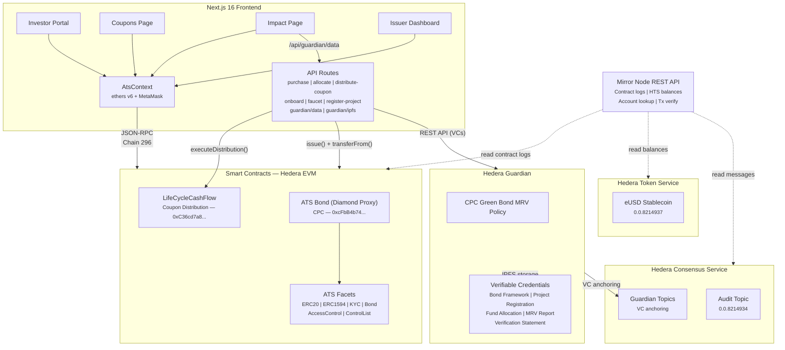

# Coppice — Green Bonds with Teeth on Hedera

**[Live App](https://www.coppice.cc)** | **[Demo Video](https://youtu.be/261J4n4K3t8)** | **[Pitch Deck](docs/pitch-deck.html)** | **[Guardian API](https://guardian.coppice.cc)**

The world needs **$7.5 trillion/year** in green investment by 2030 for net-zero. We're at $600 billion — 8% of the target. The gap isn't capital. It's trust.

Coppice is a **hybrid green bond and sustainability-linked bond** on Hedera — the first on-chain instrument combining use-of-proceeds tracking with coupon penalties for missing climate targets. It's designed to ensure that the financial incentives of the bond issuer align with the environmental outcomes investors expect.

Built on [Asset Tokenization Studio](https://github.com/hashgraph/asset-tokenization-studio) for compliant bond issuance, and [Guardian](https://github.com/hashgraph/guardian) for tracking environmental impact as Verifiable Credentials.

Named after the ancient woodland management technique where trees are sustainably harvested and regrow — a metaphor for sustainable finance.

Built for the [**Hedera Hello Future: Apex Hackathon 2026**](https://hellofuturehackathon.dev/) — Sustainability Track.

## The Problem

Green bonds have crossed [$3 trillion outstanding](https://www.lseg.com/en/insights/green-debt-market-passes-3-trillion-milestone), but four structural failures undermine investor trust:

1. **Self-certified "green"** — Issuers self-report with minimal external verification. 94% of investors believe sustainability reporting contains unsupported claims ([PwC 2023](https://www.pwc.com/gx/en/news-room/press-releases/2023/pwc-2023-global-investor-survey.html)).
2. **Opaque fund tracking** — Investors can't verify where funds went until annual reports arrive — self-authored, unverified, often 12+ months late.
3. **Off-chain compliance** — KYC/AML and jurisdiction checks live in spreadsheets. Transfer restrictions are voluntary, not protocol-level.
4. **No consequences for missing targets** — Green bonds have zero financial penalty for greenwashing. Sustainability-linked bonds (SLBs) penalize with coupon step-ups, but don't track where funds go. No instrument combines both accountability and incentives.

## The Solution

Coppice combines two financial structures that have never been combined on-chain:

**Green Bond (use-of-proceeds & MRV)** — Every fund allocation is a Guardian Verifiable Credential — recorded in real-time, anchored to HCS, stored on IPFS. Investors verify the full trust chain (project registration → allocation → MRV report → independent verification) without waiting for annual PDFs.

**Sustainability-Linked Bond (coupon penalty)** — The bond defines a Sustainability Performance Target: *"Avoid 10,000 tCO2e per coupon period."* If verified MRV data falls short, the coupon rate steps up +25bps (4.25% → 4.50%). Coupons are distributed on-chain via ATS at the verified rate — the issuer cannot override the penalty.

**Protocol-level compliance** — ATS enforces identity, KYC, AML, accredited investor status, jurisdiction, and transfer eligibility in the token contract. Non-compliant wallets cannot receive tokens — this is enforced at the protocol level, not by policy.

**Prior art:** [Verbund issued the first hybrid green+SLB](https://gsh.cib.natixis.com/our-center-of-expertise/articles/verbund-issues-world-s-first-bond-combining-use-of-proceeds-earmarking-and-kpi-linking-mechanism) in traditional finance (EUR 500M, 2021). Coppice is the first on-chain implementation.

## Architecture



### 5 Hedera Services

| Service | Role in Coppice | Example Code |
|---------|----------------|-------------|
| **Smart Contracts (ATS)** | Bond deployed as a single EVM diamond proxy with compliance, KYC, coupon management built in. LifeCycleCashFlow for automated coupon distribution via on-chain snapshots. | [ATS deployment](scripts/ats-setup.ts), [purchase API](frontend/app/api/purchase/route.ts), [distribute API](frontend/app/api/issuer/distribute-coupon/route.ts) |
| **Guardian** | 5 ICMA-aligned VC schemas: bond framework, project registration, fund allocation, MRV report, verification statement. | [Guardian setup](scripts/guardian/guardian-setup.ts), [VC schemas](scripts/guardian/schemas.ts), [data proxy](frontend/app/api/guardian/data/route.ts) |
| **Hedera Consensus Service** | Immutable audit trail — Guardian anchors all VCs to HCS topics. On-chain events timestamped and publicly queryable via [Mirror Node](https://hashscan.io/testnet/topic/0.0.8214934). | [HCS setup](scripts/hcs-setup.ts), [event feed](frontend/components/audit-event-feed.tsx) |
| **Mirror Node** | Primary frontend data source — contract event logs, HTS balance queries, account ID mapping, transaction verification. | [mirror-node lib](frontend/lib/mirror-node.ts), [contract events hook](frontend/hooks/use-contract-events.ts), [holders hook](frontend/hooks/use-holders.ts) |
| **Hedera Token Service** | eUSD stablecoin settlement — testnet stand-in for USDC. ERC-20 facade via HIP-218. | [HTS setup](scripts/hts-setup.ts), [faucet API](frontend/app/api/faucet/route.ts), [balance hook](frontend/hooks/use-eusd-balance.ts) |

### Guardian VC Trust Chain (ICMA Green Bond Principles)

| VC Type | GBP Component | What It Records |
|---------|---------------|----------------|
| **Bond Framework** | Project Evaluation & Selection | Eligible ICMA categories, SPT target, coupon terms |
| **Project Registration** | Project Evaluation & Selection | Name, ICMA category, location, EU Taxonomy alignment |
| **Fund Allocation** | Use of Proceeds + Management | Amount, purpose, Hedera tx ID — on-chain cross-ref |
| **MRV Report** | Reporting (ICMA Harmonised Framework) | tCO2e avoided, MWh generated, methodology |
| **Verification Statement** | External Review | Independent verifier (separate DID) confirms impact |

## Live Demo

**Live App:** [coppice.cc](https://www.coppice.cc) | **Demo Video:** [YouTube](https://youtu.be/261J4n4K3t8) | **CPC Bond:** [`0.0.8254921`](https://hashscan.io/testnet/contract/0.0.8254921) (importable in Hedera's testnet Tokenization Studio)

| Page | Purpose |
|------|---------|
| **[Invest](https://www.coppice.cc)** | Where investors verify compliance and purchase bonds. ATS checks identity, KYC, jurisdiction, and accreditation before allowing token issuance. Alice passes all checks and can purchase CPC with eUSD. Bob can self-promote via the UI (for judge onboarding). Charlie is blocked — restricted jurisdiction enforced at the protocol level. |
| **[Coupons](https://www.coppice.cc/coupons)** | Shows the bond's coupon schedule with on-chain data. Investors see annual rate (4.25% base / 4.50% penalty), face value, record and execution dates, and whether the on-chain snapshot has been taken for each coupon period. |
| **[Impact](https://www.coppice.cc/impact)** | Where investors verify that funds are being used as promised and making real environmental impact. Shows Guardian-verified projects with full evidence chains (IPFS + HCS links), SPT progress toward the 10,000 tCO2e target, and ICMA Green Bond Principles alignment. |
| **[Issuer](https://www.coppice.cc/issue)** | Administrative dashboard for the bond issuer. Issue tokens, freeze/unfreeze wallets, pause/unpause trading, allocate proceeds to green projects via Guardian, create coupons (with SPT enforcement), distribute coupon payments, and register new projects. |

Every action is a real Hedera testnet transaction. Every HashScan and IPFS link is clickable and verifiable.

## Quick Start

### Prerequisites
- Node.js 20 or 22 LTS
- MetaMask configured for [Hedera Testnet (Chain 296)](https://chainlist.org/chain/296)

### Setup

```bash
# Clone and install
git clone <repo-url>
cd hedera-green-bonds
npm install

# Run smart contract tests (local Hardhat network)
cd contracts && npx hardhat test

# Run frontend unit tests
cd ../frontend && npx vitest run

# Start frontend dev server
cd ../frontend && npm run dev

# Run E2E tests (requires frontend running)
cd ../e2e && npx playwright test
```

### Deploy to Hedera Testnet

```bash
# 1. Configure environment (each workspace has its own .env)
cp contracts/.env.example contracts/.env    # Add deployer key
cp scripts/.env.example scripts/.env        # Add Hedera operator
cp scripts/guardian/.env.example scripts/guardian/.env  # Guardian credentials

# 2. Deploy ATS bond + LifeCycleCashFlow
cd scripts && npx tsx ats-setup.ts

# 3. Create HCS topics and HTS eUSD stablecoin
cd scripts && npx tsx hcs-setup.ts
cd scripts && npx tsx hts-setup.ts

# 4. Set up Guardian policy and populate demo data
cd scripts/guardian && npx tsx guardian-setup.ts
cd scripts/guardian && npx tsx guardian-populate.ts

# 5. Start frontend
cd frontend && npm run dev
```

## On-Chain Identity & Compliance

Bonds are regulated securities — securities law requires issuers to verify investor identity (KYC/AML) before allowing participation. ATS enforces this at the protocol level: identity, KYC, AML, accredited investor status, jurisdiction, and transfer eligibility are all checked in the token contract before any transfer executes.

### How an Investor Becomes "Verified"

1. **Register identity** — ATS registers the investor's wallet with KYC status and country code ([onboard API](frontend/app/api/onboard/route.ts))
2. **Whitelist** — Investor is added to the bond's control list ([ats-setup.ts](scripts/ats-setup.ts))
3. **Compliance check** — At transfer time, the ATS diamond proxy verifies identity, KYC claims, jurisdiction, and balance limits ([compliance hook](frontend/hooks/use-compliance.ts))
4. **Transfer or revert** — Non-compliant transfers revert at the protocol level — the token cannot be sent to unverified wallets

### Demo Wallets

| Role | Hedera Account | Country | Status |
|------|---------------|---------|--------|
| Deployer/Issuer | [`0.0.8213176`](https://hashscan.io/testnet/account/0.0.8213176) | — | Token agent — manages issuance, freeze, pause |
| Alice (Verified) | [`0.0.8213185`](https://hashscan.io/testnet/account/0.0.8213185) | DE (276) | Verified investor — full compliance |
| Bob (Self-promote) | [`0.0.8214040`](https://hashscan.io/testnet/account/0.0.8214040) | US (840) | Can self-promote via UI for judge onboarding |
| Charlie (Restricted) | [`0.0.8214051`](https://hashscan.io/testnet/account/0.0.8214051) | CN (156) | Registered but country restricted |
| Diana (Freeze demo) | [`0.0.8214895`](https://hashscan.io/testnet/account/0.0.8214895) | FR (250) | Verified — freeze/unfreeze demo |

## SPT Enforcement — The "Teeth"

Green bonds are just bonds with guidelines on how the issuer should invest. Sustainability-linked bonds provide a financial penalty should the issuer fail to meet sustainability targets. Coppice combines both so the financial incentives of the bond align with the environmental outcomes investors expect.

The Sustainability Performance Target ties the coupon rate to **verified MRV data** from Guardian:

- **Target:** Avoid 10,000 tCO2e per coupon period across all funded projects
- **Target met:** Coupon stays at 4.25%
- **Target missed:** Coupon steps up to 4.50% (+25bps)

The [create-coupon API](frontend/app/api/issuer/create-coupon/route.ts) is hard-gated by the [SPT enforcement module](frontend/lib/spt-enforcement.ts): if the SPT is missed, coupons cannot be created below the penalty rate. Coupons are distributed on-chain via the [LifeCycleCashFlow contract](contracts/contracts/mass-payout/LifeCycleCashFlow.sol) using ATS snapshots — the issuer cannot override the penalty.

## Project Structure

```
hedera-green-bonds/
├── contracts/                   # Hardhat project — Solidity 0.8.17 + 0.8.22
│   ├── contracts/
│   │   ├── Imports.sol              # ERC-3643 contracts (for local test suite)
│   │   └── mass-payout/            # LifeCycleCashFlow (coupon distribution)
│   └── test/                       # 32 Hardhat tests (deployment, compliance, transfers)
├── scripts/                     # Hedera setup scripts
│   ├── ats-setup.ts                 # Deploy ATS bond, configure roles, mint, set coupons
│   ├── hcs-setup.ts                 # Create HCS audit + impact topics
│   ├── hts-setup.ts                 # Create eUSD, associate wallets, distribute
│   └── guardian/                    # Guardian policy setup, populate, verify SPT
├── frontend/                    # Next.js 16 App Router + Tailwind CSS v4
│   ├── app/
│   │   ├── page.tsx                 # Investor Portal — compliance checks, purchase flow
│   │   ├── coupons/page.tsx         # Coupon schedule — rates, dates, snapshot status
│   │   ├── impact/page.tsx          # Guardian impact — projects, MRV, SPT progress
│   │   ├── issue/page.tsx           # Issuer Dashboard — issue, freeze, allocate, distribute
│   │   └── api/                     # 11 API routes (purchase, allocate, distribute, etc.)
│   ├── components/              # 30 components (bond, compliance, guardian, issuer, UI)
│   ├── hooks/                   # 11 hooks (token, identity, compliance, coupons, guardian)
│   ├── contexts/ats-context.tsx # ATS diamond proxy integration (ethers v6 + MetaMask)
│   └── lib/                     # Hedera utils, ABIs, constants, Guardian types, SPT enforcement
├── e2e/                         # Playwright E2E tests — MetaMask mock with real tx signing
│   └── tests/                       # 10 spec files (64 tests)
├── packages/common/             # Shared ABIs (generated via wagmi CLI)
└── docs/                        # Pitch deck, architecture diagrams, research
```

## Testing

**227 tests total** — 32 contract + 131 unit + 64 E2E

### Smart Contract Tests (32)
```bash
cd contracts && npx hardhat test
```
Deployment verification, identity/compliance checks (verified vs. unverified vs. restricted country), compliant and rejected transfers, freeze/unfreeze, pause/unpause, minting access control, supply limits.

### Frontend Unit Tests (131)
```bash
cd frontend && npx vitest run
```
21 test files covering API routes (purchase, allocate, distribute-coupon, create-coupon, faucet, onboard, guardian-data, grant-agent-role, health), hooks (guardian, coupons, identity, contract-events, count-up), lib modules (constants, retry, api-client, auth, spt-enforcement), components (nav), and pages (impact).

### E2E Browser Tests (64)
```bash
cd e2e && npx playwright test
```
10 spec files with a custom MetaMask mock that signs real transactions on Hedera testnet:

- **Investor Portal** — Bond details, Alice compliance (green checks), Bob self-promotion, Charlie rejection (restricted country), portfolio display, purchase flow
- **Issuer Dashboard** — Issue tokens, freeze/unfreeze, pause/unpause, allocate proceeds, distribute coupons, register projects
- **Coupons Page** — Coupon schedule display, rate formatting, on-chain data
- **Impact Page** — Guardian data display, SPT progress, project cards
- **Guardian Live** — Real Guardian API integration tests
- **Write Operations** — Real testnet transactions (issue, freeze, pause)
- **Full Demo Flow** — Multi-page navigation, wallet state management
- **Accessibility** — WCAG compliance, focus management, ARIA labels
- **Mobile** — Responsive design at 390x844, hamburger menu, touch targets
- **Faucet** — eUSD faucet for demo wallets

### Remote E2E (against Vercel deployment)
```bash
E2E_BASE_URL=https://www.coppice.cc npx playwright test guardian-live impact-page coupons-page
```

## Tech Stack

| Layer | Technology |
|-------|-----------|
| Smart Contracts | Solidity 0.8.17 + 0.8.22, [ATS](https://github.com/hashgraph/asset-tokenization-studio) (ERC-3643 diamond proxy), [LifeCycleCashFlow](contracts/contracts/mass-payout/LifeCycleCashFlow.sol), OpenZeppelin v4.9.6 |
| Frontend | Next.js 16.1.6, React 19, ethers v6, Tailwind CSS v4, TanStack Query v5 |
| Guardian | Hedera Guardian, 5 ICMA-aligned VC schemas, HAProxy TLS |
| Testing | Hardhat (contracts), vitest 4.1 (unit), Playwright 1.49 (E2E) |
| Build | Turborepo monorepo, TypeScript, npm workspaces |
| Deployment | Hedera Testnet (Chain 296), Vercel (frontend) |

## Deployed Contracts & Resources (Hedera Testnet)

### Smart Contracts

| Contract | Account ID | EVM Address | HashScan |
|----------|-----------|-------------|----------|
| CPC Bond (ATS) | `0.0.8254921` | `0xcFbB4b74EdbEB4FE33cD050d7a1203d1486047d9` | [View](https://hashscan.io/testnet/contract/0.0.8254921) |
| LifeCycleCashFlow | `0.0.8254941` | `0xC36cd7a8C15B261C1e6D348fB1247D8eCBB8c350` | [View](https://hashscan.io/testnet/contract/0.0.8254941) |

### HCS Topics

| Topic | ID | Memo | HashScan |
|-------|------|------|----------|
| Compliance Audit Trail | `0.0.8214934` | Coppice Compliance Audit Trail | [View](https://hashscan.io/testnet/topic/0.0.8214934) |
| Impact Tracking | `0.0.8214935` | Coppice Green Bond Impact Tracking | [View](https://hashscan.io/testnet/topic/0.0.8214935) |

### HTS Tokens

| Token | ID | Symbol | Supply | HashScan |
|-------|------|--------|--------|----------|
| Coppice USD | `0.0.8214937` | eUSD | INFINITE (2 decimals) | [View](https://hashscan.io/testnet/token/0.0.8214937) |

## Ecosystem Alignment

- **[ERC-3643 Association](https://www.erc3643.org/)** — DTCC, ABN AMRO, Deloitte, Fireblocks, Hedera Foundation. $32B+ tokenized using this standard.
- **[ABN AMRO precedent](https://tokeny.com/success-story-abn-amros-bond-tokenization-on-polygon/)** — EUR 5M digital green bond on Polygon using ERC-3643 (Sept 2023). Coppice adds Guardian-verified impact + SPT penalties on a carbon-negative chain.
- **[EU DLT Pilot Regime](https://eur-lex.europa.eu/eli/reg/2022/858/oj/eng)** — Bonds under EUR 1B can be issued on DLT within a regulatory sandbox. Concrete legal pathway to mainnet issuance.
- **[Verra partnership](https://verra.org/verra-and-hedera-to-accelerate-digital-transformation-of-carbon-markets/)** — 5-year partnership with Guardian to digitalize 20+ carbon methodologies.

## Roadmap

| Phase | Milestone |
|-------|-----------|
| **Institutional Pilot** | Partner with a green bond issuer for testnet/mainnet pilot |
| **EU DLT Pilot Regime** | Apply under Reg. 2022/858 — bonds under EUR 1B qualify for DLT sandbox |
| **Automated dMRV** | Integrate IoT/satellite data via Guardian — HYPHEN and B4E show this is production-ready on Hedera |
| **Multi-bond Platform** | Multiple issuers, independent compliance rules, secondary market trading |

## License

**Proprietary** — All rights reserved, except `contracts/`, which is GPL-3.0 as required by the [ERC-3643 dependency](https://github.com/ERC-3643/ERC-3643). See [LICENSE](LICENSE) for details.
