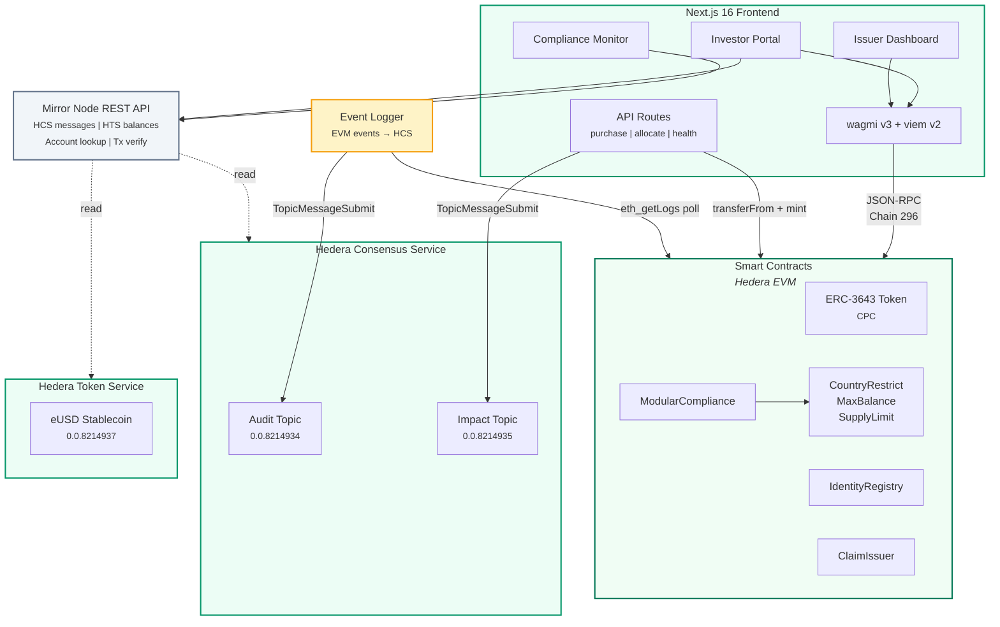

# Architecture Diagram (Mermaid)

Render this in any Mermaid-compatible tool (GitHub README, Mermaid Live Editor, etc.)

```mermaid
graph TD
    subgraph Frontend["Next.js 16 Frontend"]
        IP["Investor Portal"]
        ID["Issuer Dashboard"]
        CM["Compliance Monitor"]
        WV["wagmi v3 + viem v2"]
        API["API Routes<br/><small>purchase | allocate | health</small>"]
    end

    subgraph SC["Smart Contracts<br/><i>Hedera EVM</i>"]
        Token["ERC-3643 Token<br/><small>CPC</small>"]
        IR["IdentityRegistry"]
        MC["ModularCompliance"]
        CI["ClaimIssuer"]
        Modules["CountryRestrict<br/>MaxBalance<br/>SupplyLimit"]
    end

    subgraph HCS["Hedera Consensus Service"]
        Audit["Audit Topic<br/><small>0.0.8214934</small>"]
        Impact["Impact Topic<br/><small>0.0.8214935</small>"]
    end

    subgraph HTS["Hedera Token Service"]
        eUSD["eUSD Stablecoin<br/><small>0.0.8214937</small>"]
    end

    MN["Mirror Node REST API<br/><small>HCS messages | HTS balances<br/>Account lookup | Tx verify</small>"]

    EL["Event Logger<br/><small>EVM events → HCS</small>"]

    IP & ID --> WV
    WV -->|"JSON-RPC<br/>Chain 296"| SC
    API -->|"transferFrom + mint"| SC
    API -->|"TopicMessageSubmit"| Impact
    CM --> MN
    IP --> MN

    EL -->|"eth_getLogs poll"| SC
    EL -->|"TopicMessageSubmit"| Audit

    MN -.->|"read"| HCS
    MN -.->|"read"| HTS

    MC --> Modules

    style Frontend fill:#ecfdf5,stroke:#059669,stroke-width:2px
    style SC fill:#f0fdf4,stroke:#047857,stroke-width:2px
    style HCS fill:#ecfdf5,stroke:#059669,stroke-width:2px
    style HTS fill:#ecfdf5,stroke:#059669,stroke-width:2px
    style MN fill:#f1f5f9,stroke:#64748b,stroke-width:2px
    style EL fill:#fef3c7,stroke:#f59e0b,stroke-width:2px
```
