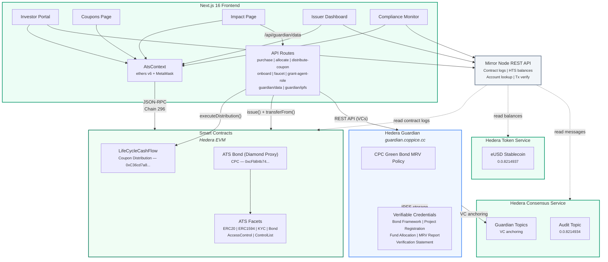

# Architecture Diagram (Mermaid)

Render this in any Mermaid-compatible tool (GitHub README, Mermaid Live Editor, etc.)

## 5 Hedera Services

1. **Smart Contracts (EVM)** -- ATS Bond (diamond proxy with ERC20, ERC1594, KYC, Bond, AccessControl, ControlList facets) + LifeCycleCashFlow (coupon distribution via mass payout)
2. **Hedera Consensus Service** -- Guardian VC anchoring topics (immutable provenance chain for MRV data)
3. **Hedera Token Service** -- eUSD stablecoin (FungibleCommon, 2 decimals) for bond settlement
4. **Mirror Node API** -- Contract event logs (primary frontend data source), HTS balance queries, account ID mapping, transaction verification
5. **Guardian** -- Verifiable Credential workflow for anti-greenwashing: bond framework, project registration, fund allocation, MRV monitoring, verification statements

## Tech Stack

| Layer | Technology |
|-------|-----------|
| Contracts | Solidity 0.8.17 + 0.8.22, ATS (ERC-3643 diamond proxy), LifeCycleCashFlow, OpenZeppelin v4.9.6 |
| Frontend | Next.js 16, React 19, ethers v6, custom AtsContext, Tailwind CSS v4 |
| Backend | Next.js API routes (purchase, allocate, distribute-coupon, onboard, faucet, guardian proxy) |
| Guardian | Hedera Guardian v3.5.0, 5 VC schemas (ICMA-aligned), HAProxy TLS |
| Services | Next.js API routes (purchase, allocate, distribute-coupon, onboard, faucet, guardian proxy) |
| Testing | Hardhat (contracts), vitest (unit), Playwright (E2E) |
| Build | Turborepo monorepo, TypeScript throughout |
